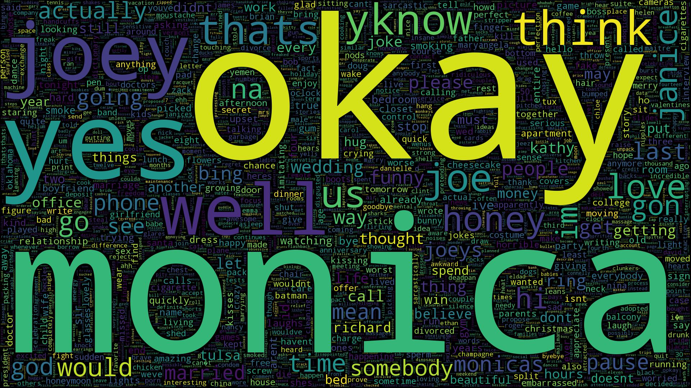
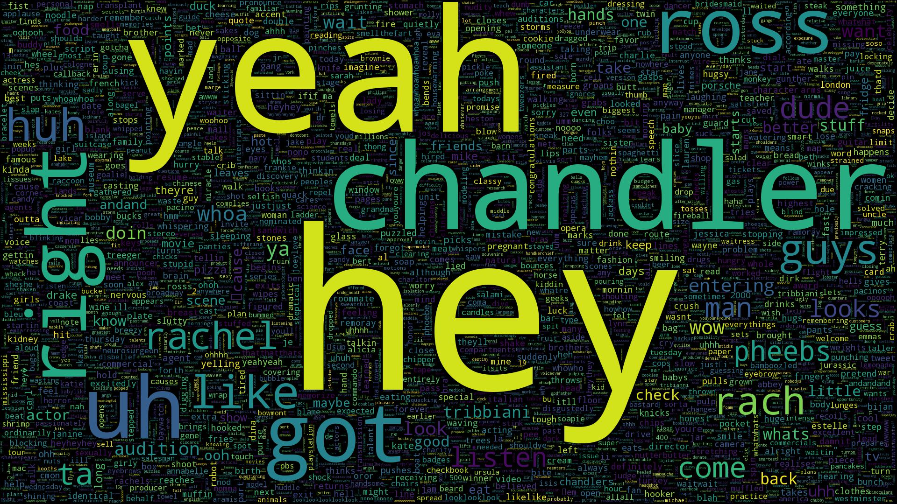

# Text Classification on Friends Characters

## Data Gathering - P2/RawData
<ol>
<li>Language: english, differentiation between two characters dialogues in friends series (joey and chandler)</li>
<li>It's interesting for me to find out the person who is talking with his/her frequent words and phrases.</li>
<li>Data Source: https://fangj.github.io/friends/</li>
<li>All episodes transcripts can be found in the link above. I wrote a web scrapper using java Jsoup library and fetched the data. jsoup jar file is placed in src directory </li>
</ol>
For all following sections you just need to run the python file in src directory.

## Data Extraction - P2/Data
The python code in src directory reads each text file in RawData directory and finds any dialogue that belongs to first character or second character then it stores dialogues in separate directories (label1 and label2).

## Data Processing - P2/ProcessedData
I have normalized and tokenized each episode transcript in Data/label1 and Data/label2 directory and save it to ProcessedData/label1 and ProcessedData/label2.

**Normalization Step:**
<ol>
<li>converting all letters to lower case</li>
<li>removing numbers</li>
<li>removing punctuations</li>
<li>removing white spaces</li>
</ol>

**Tokenization Step:**
<ol>
<li>Tokenize each line using nltk</li>
<li>Store word tokens in ProcessedData/label1 and ProcessedData/label2</li>
</ol>

## Analysis - P2/WordCloud

In this section, i gathered all words for label1 and label2 from Processed Transcripts in ProcessedData/label1 and ProcessedData/label2.  
Then i computed desired wordClouds and passed them to WordCloud library for visualization.

**word cloud #1:** words frequencies for label1  
**word cloud #2:** words frequencies for label2  
**word cloud #5:** words frequencies without stop words for label1  
**word cloud #6:** words frequencies without stop words for label2  
**word cloud #3:** label1 words frequencies minus label2 words frequencies. negative values are truncated to zero.  
**word cloud #4:** label2 words frequencies minus label1 words frequencies. negative values are truncated to zero.  
**word cloud #7 and #8:** same as 3 and 4 but stop words are removed.  

words_frequencies with and without stop words (word cloud # 1, 2, 5, 6): 
words frequencies without removing stop words show that which words are more frequent, so words like pronouns are more common than the others. but these words are usually common in every context and their presence is not going to help us for tasks like classification and generally finding a difference between labels. consequently, we delete them.

differential words_frequencies with and without stop words (word cloud #3, 4, 7, 8):
these word clouds highlight the difference between two labels. for a label, words that are common in it and uncommon in the other one have bigger font size . for the same reason in the above explanation, its better to remove stop words.

**Chandler differential words frequencies, stop words removed (8.jpg)**  
  
  
**Joey differential words frequencies, stop words removed (7.jpg)**  
  

# Training 
## Split Data - P2/SplitData

Picks even indices between all transcripts in a while loop until 80% of all tokens are selected.

## Language Models - P2/Model
In this part i generated unigram, bigram and trigram models and stored them in files.

## Perplexity - P2/Perplexity
This section Calculates perplexity using language models. You can see the results in [P2/Perplexity/Report.md](https://github.com/moein99/NLP/blob/master/P2/Perplexity/Report.md) 

## Text Generation - P2/TextGen
With Using language models in previous steps, i've generated some texts which are related to that character.  
n-grams are generated without considering their probabilities. they will be more likely to labeled data if we generate them with respect to their probabilities (weighted random).

The output of each label looks like its training data. as we increase the number of grams, the generated sentences are more realistic.

## SRILM Tool - P2/SRILM
With SRILM Tool, i did pervious parts once again and concluded the same results.  
Models are almost the same. for example: "our keys" prob in my bigram = 0.0005167068549776093 and it's prob in SRLIM bigram = 10 ^ (-3.286756) = 0.0005167065893943473  

Same results can be concluded from log perplexities in this section.
